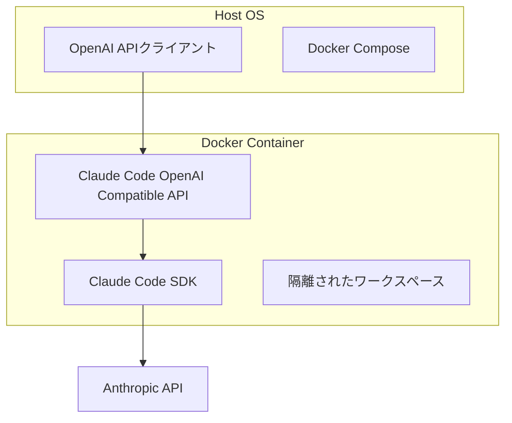

# 設計書

## 概要

Claude Code SDKをバックエンドとしたOpenAI API互換サーバーの設計書です。このシステムは、既存のOpenAI APIクライアントがClaude Codeの機能を透過的に利用できるようにするプロキシサーバーとして機能します。

## アーキテクチャ

### 全体アーキテクチャ



### レイヤー構成

1. **APIレイヤー**: OpenAI API互換のHTTPエンドポイント
2. **変換レイヤー**: OpenAI API形式とClaude Code SDK間のデータ変換
3. **SDKレイヤー**: Claude Code SDKを使用したClaude Codeとの通信
4. **セキュリティレイヤー**: 認証、認可、ファイルシステム隔離

## コンポーネントと インターフェース

### 1. HTTP APIサーバー

**責任**: OpenAI API互換のHTTPエンドポイントを提供

**主要エンドポイント**:
- `GET /v1/models` - 利用可能なモデル一覧
- `POST /v1/chat/completions` - チャット補完
- `POST /v1/completions` - テキスト補完
- `POST /v1/embeddings` - テキスト埋め込み（未対応エラーを返す）
- `GET /health` - ヘルスチェック
- `GET /metrics` - メトリクス情報

**技術スタック**: Node.js + Express.js

### 2. リクエスト変換器

**責任**: OpenAI API形式のリクエストをClaude Code SDK形式に変換

**主要機能**:
- メッセージ形式の変換
- パラメータマッピング
- ストリーミング対応
- エラーハンドリング
- 未対応機能の適切なエラー応答

**インターフェース**:
```typescript
interface RequestTransformer {
  transformChatRequest(openaiRequest: OpenAIChatRequest): ClaudeCodeRequest;
  transformCompletionRequest(openaiRequest: OpenAICompletionRequest): ClaudeCodeRequest;
  transformModelsRequest(): ClaudeCodeModelsRequest;
  // embeddings は未対応のためエラーレスポンスを生成
}
```

### 3. レスポンス変換器

**責任**: Claude Code SDKのレスポンスをOpenAI API形式に変換

**主要機能**:
- レスポンス形式の変換
- ストリーミングレスポンスの処理
- エラーレスポンスの変換
- メタデータの付与

**インターフェース**:
```typescript
interface ResponseTransformer {
  transformChatResponse(claudeResponse: ClaudeCodeResponse): OpenAIChatResponse;
  transformCompletionResponse(claudeResponse: ClaudeCodeResponse): OpenAICompletionResponse;
  transformModelsResponse(models: ClaudeCodeModel[]): OpenAIModelsResponse;
  createUnsupportedError(feature: string): ErrorResponse;
}
```

### 4. Claude Code SDKクライアント

**責任**: Claude Code SDKを使用してClaude Codeとの通信を管理

**主要機能**:
- SDK初期化と設定
- チャット機能の呼び出し
- ファイル操作の管理
- セッション管理

**インターフェース**:
```typescript
interface ClaudeCodeClient {
  initialize(workspaceConfig: WorkspaceConfig): Promise<void>;
  chat(request: ClaudeCodeRequest): Promise<ClaudeCodeResponse>;
  complete(request: ClaudeCodeRequest): Promise<ClaudeCodeResponse>;
  getModels(): Promise<ClaudeCodeModel[]>;
  createSession(): Promise<string>;
  // embed機能は未対応
  // OAuth認証はClaude Code SDKが管理
}
```

### 5. セキュリティマネージャー

**責任**: 認証、認可、ファイルシステム隔離の管理

**主要機能**:
- OAuth認証管理
- ワークスペース隔離
- ファイルアクセス制御
- Claude Code設定ディレクトリ管理
- UID/GID権限マッピング
- セキュリティログ

## データモデル

### OpenAI API互換モデル

```typescript
interface OpenAIChatRequest {
  model: string;
  messages: OpenAIMessage[];
  temperature?: number;
  max_tokens?: number;
  stream?: boolean;
}

interface OpenAICompletionRequest {
  model: string;
  prompt: string;
  temperature?: number;
  max_tokens?: number;
  stream?: boolean;
}

interface OpenAIEmbeddingRequest {
  model: string;
  input: string | string[];
  encoding_format?: string;
}

interface OpenAIMessage {
  role: 'system' | 'user' | 'assistant';
  content: string;
}

interface OpenAIChatResponse {
  id: string;
  object: 'chat.completion';
  created: number;
  model: string;
  choices: OpenAIChatChoice[];
  usage: OpenAIUsage;
}

interface OpenAICompletionResponse {
  id: string;
  object: 'text_completion';
  created: number;
  model: string;
  choices: OpenAICompletionChoice[];
  usage: OpenAIUsage;
}

interface OpenAIEmbeddingResponse {
  object: 'list';
  data: OpenAIEmbedding[];
  model: string;
  usage: OpenAIUsage;
}

interface OpenAIEmbedding {
  object: 'embedding';
  embedding: number[];
  index: number;
}
```

### Claude Code SDK モデル

```typescript
interface ClaudeCodeRequest {
  message: string;
  context?: string;
  workspace?: string;
  tools?: string[];
}

interface ClaudeCodeResponse {
  content: string;
  toolCalls?: ToolCall[];
  metadata?: ResponseMetadata;
}
```

### 設定モデル

```typescript
interface ServerConfig {
  port: number;
  logLevel: string;
  timeoutMs: number;
  cors: {
    enabled: boolean;
    origins: string;
  };
  claude: {
    timeout: number;
  };
}

// OAuth設定はClaude Code SDKが管理

interface WorkspaceConfig {
  baseDir: string;
  timeoutMs: number;
}
```

## エラーハンドリング

### エラー分類

1. **クライアントエラー (4xx)**
   - 400: 不正なリクエスト形式
   - 401: 認証エラー
   - 429: レート制限超過
   - 501: 未実装機能（embeddings等）

2. **サーバーエラー (5xx)**
   - 500: 内部サーバーエラー
   - 502: Claude Code SDK通信エラー
   - 503: サービス利用不可
   - 401: OAuth認証エラー

### エラーレスポンス形式

```typescript
interface ErrorResponse {
  error: {
    message: string;
    type: string;
    code: string;
  };
}
```

### エラー処理戦略

- **リトライ機能**: 一時的なエラーに対する自動リトライ
- **フォールバック**: Claude Code SDK障害時の代替処理
- **ログ記録**: 詳細なエラーログとトレーシング

## テスト戦略

### 単体テスト

- **対象**: 各コンポーネントの個別機能
- **フレームワーク**: Jest (Node.js)
- **カバレッジ**: 80%以上

### 統合テスト

- **対象**: コンポーネント間の連携
- **テストケース**:
  - OpenAI API → Claude Code SDK変換（chat/completions）
  - embeddings未対応エラーレスポンス
  - ストリーミングレスポンス処理
  - エラーハンドリング
  - 各エンドポイントの正常系・異常系

### E2Eテスト

- **対象**: 実際のAPIクライアントからの完全なフロー
- **テストシナリオ**:
  - チャット補完の完全フロー
  - テキスト補完の完全フロー
  - 埋め込み生成の未対応エラー応答
  - モデル一覧取得
  - ストリーミング処理
  - エラーケース処理

### セキュリティテスト

- **対象**: ファイルシステム隔離とセキュリティ機能
- **テストケース**:
  - ホストOSへのアクセス拒否
  - 不正なファイル操作の防止
  - OAuthトークン漏洩防止
  - UID/GID権限の適切なマッピング
  - Claude Code設定ディレクトリのアクセス権限

## Docker化設計

### Dockerfile構成

```dockerfile
FROM node:22-alpine

# UID/GIDマッピング用のユーザー作成
ARG UID=1000
ARG GID=1000
RUN addgroup -g ${GID} appgroup && \
    adduser -D -u ${UID} -G appgroup appuser

WORKDIR /app
COPY package*.json ./
RUN npm ci --only=production

# Claude Code設定ディレクトリの準備
RUN mkdir -p /home/appuser/.claude && \
    chown -R appuser:appgroup /home/appuser/.claude

COPY --chown=appuser:appgroup . .
EXPOSE 1235
USER appuser
CMD ["npm", "start"]
```

### Docker Compose設定

```yaml
services:
  claude-code-lmstudio-api:
    build: .
    ports:
      - "1235:1235"
    env_file:
      - .env
    volumes:
      - workspace:/app/workspace
      - ~/.claude:/home/appuser/.claude:rw
    user: "${UID:-1000}:${GID:-1000}"
    security_opt:
      - no-new-privileges:true
    read_only: true
    tmpfs:
      - /tmp
volumes:
  workspace:
```

### セキュリティ設定

- **読み取り専用ファイルシステム**: アプリケーションファイルの変更を防止
- **専用ボリューム**: ワークスペース用の隔離されたボリューム
- **UID/GIDマッピング**: ホストOSのユーザー権限と適切にマッピング
- **Claude Code設定共有**: ~/.claude ディレクトリのrwマウント
- **非特権ユーザー**: rootユーザーでの実行を回避
- **セキュリティオプション**: 追加の権限昇格を防止

## 監視とログ

### ログ設計

- **構造化ログ**: JSON形式での出力
- **ログレベル**: DEBUG, INFO, WARN, ERROR
- **ログローテーション**: サイズベースのローテーション

### メトリクス

- **リクエスト数**: エンドポイント別の処理数
- **レスポンス時間**: 平均・最大・最小レスポンス時間
- **エラー率**: エラータイプ別の発生率
- **リソース使用量**: CPU、メモリ使用率

### ヘルスチェック

```typescript
interface HealthStatus {
  status: 'healthy' | 'unhealthy';
  timestamp: string;
  services: {
    claudeCodeSdk: 'up' | 'down';
    anthropicApi: 'up' | 'down';
  };
  version: string;
}
```

## 拡張性設計

### 将来的なAPI対応

- **プラグインアーキテクチャ**: 新しいAPIバックエンドの追加を容易にする
- **設定ベース切り替え**: 実行時のバックエンド選択
- **統一インターフェース**: 共通のAPIインターフェースを維持

### スケーラビリティ

- **水平スケーリング**: 複数インスタンスでの負荷分散対応
- **キャッシュ機能**: 頻繁なリクエストのキャッシュ
- **非同期処理**: 長時間処理の非同期化

## 設定管理

### 環境変数（.envファイルで管理）

下記の.envファイル設定を参照

### .envファイル設定

```bash
# サーバー設定
PORT=1235
LOG_LEVEL=info
TIMEOUT_MS=30000

# Docker設定
UID=1000
GID=1000

# CORS設定
CORS_ENABLED=true
CORS_ORIGINS=*

# Claude Code設定
CLAUDE_TIMEOUT=30000
```